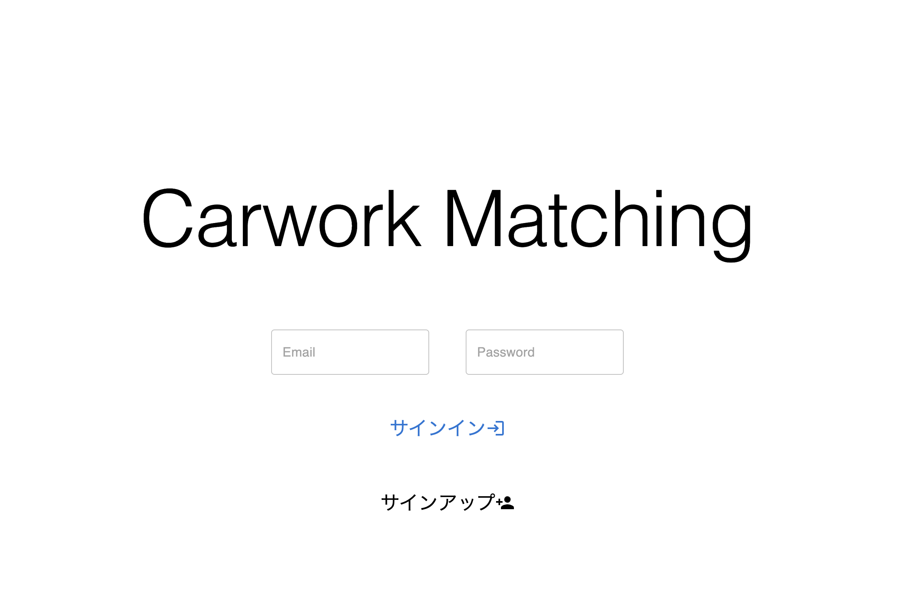
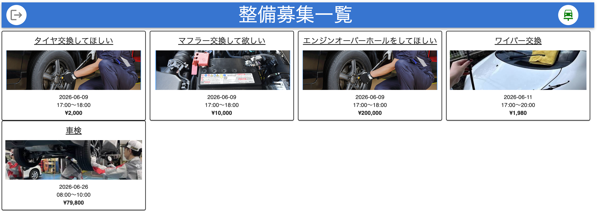
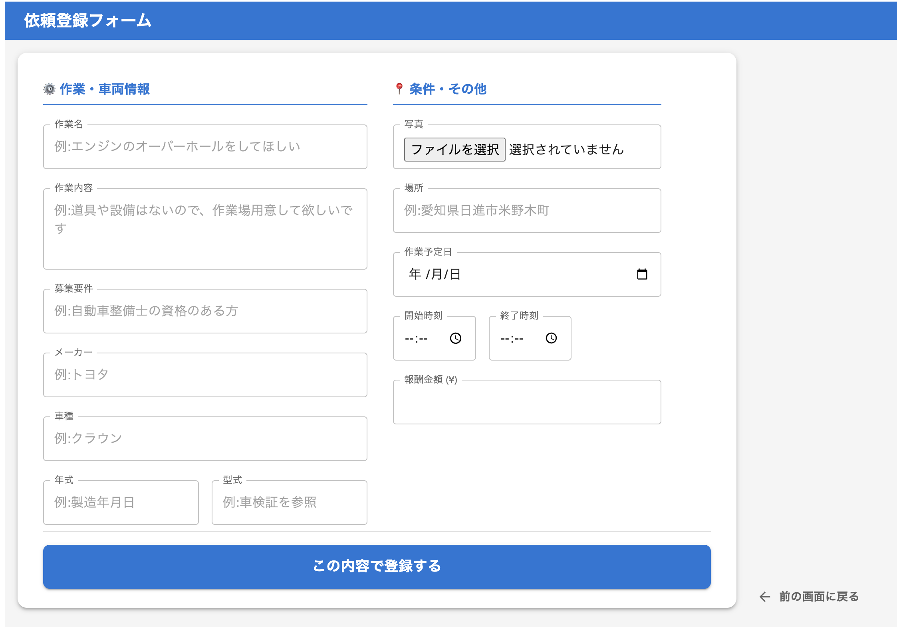
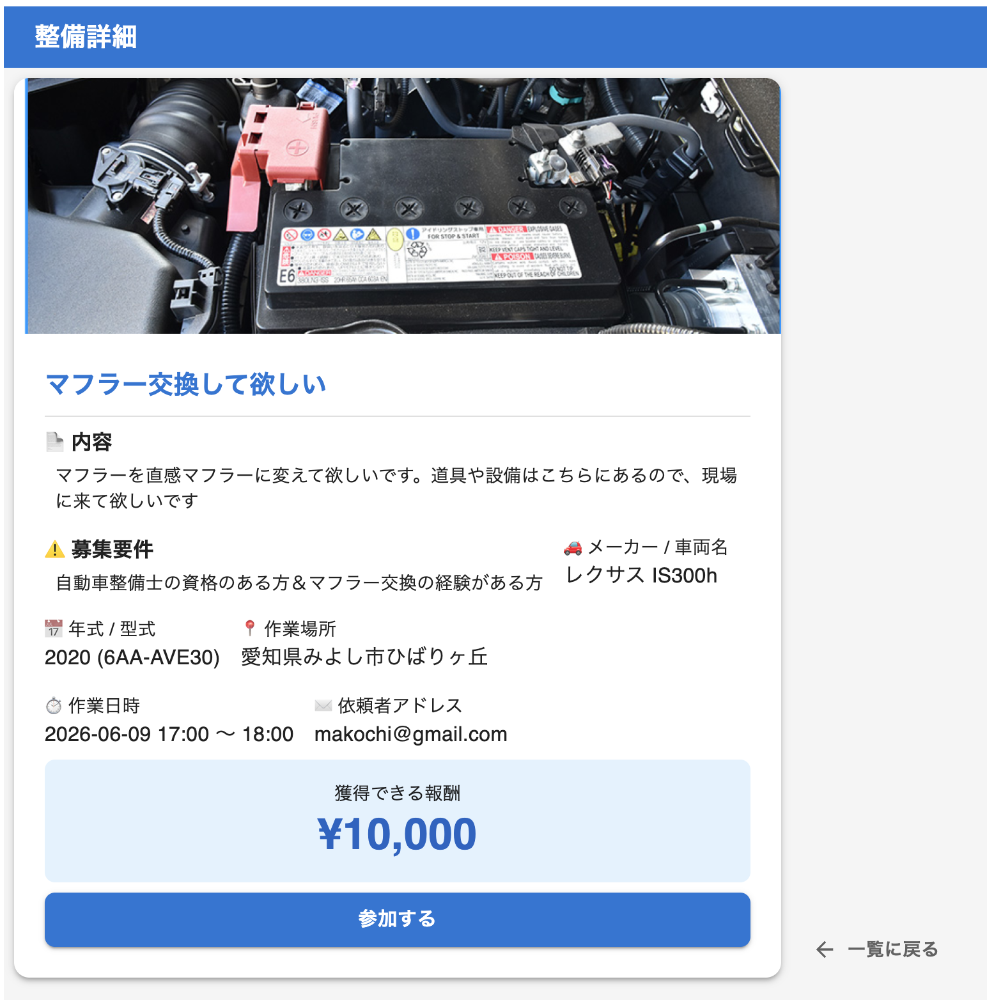

# carwork_matching

#

プロジェクト名 - carwork_matching

#

概要 - 自動車整備に関する仕事を募集できるアプリ

        -依頼者が整備内容と報酬を投稿。
         参加側はその投稿に反応してマッチングできる。

#

ログイン画面のデモ画像

依頼案件のリスト画面

依頼の登録画面

依頼案件の内容確認画面

#

機能・特徴

    - 整備したい人と整備する側のマッチングができる
      - 自動車整備のスキルを活かして報酬をもらえる
      - 車に詳しくない人でもカスタムができる
      - 引っ越してきた人で繋がりが少ない人でも利用できる

#

技術スタック

    -フロントエンド:React 19, React-Router, MUI,
    -バックエンド:Node.js, Express, knex, PostgreSQL,
    -インフラ: Fire Base, Render, AWS

#

インストール・セットアップ
-Node.js 20以上
-npm 10以上

        -1 .git clone  git@github.com:gackey-no-tsukai/carwork_matching.git
        -2 npm install
        -3 npm run dev
        -4 cd front
        -5 npm install
        -6 npm run dev

        -7 データベースのセットアップ　npm run migrate-latest
        -8 データベースへ初期データ挿入（任意）　npm run seed-data

#

使用方法

    -1. アカウント作成:トップページのサインアップを押下し、メールアドレス・パスワードを登録する。
    -2. 登録した情報を入力してサインインする。
    -3. 整備依頼リスト画面に遷移する。
    -4. 表示されている依頼リストをクリックすると依頼詳細画面に遷移する。
    -5. 内容を確認し、依頼を受ける場合は参加するボタンを押す。
        再度押すと解除。１依頼につき１参加なので、すでに誰かが参加している場合はボタンが表示されない。
    -6. 整備依頼リスト画面右上の車アイコンから登録画面へ遷移する。
    -7. 入力案内に従って入力し、登録ボタンを押す。登録した内容が整備依頼リスト画面に入ってくる。

#

デプロイ

    -renderサイト. https://carwork-matching-4p06.onrender.com

#

ディレクトリ構成

    |────
    | ├── db
    │ ├── migrations
    │ │ ├── 20260604021007_create_users_table.js
    │ │ └── 20260604021027_create_posts_table.js
    │ └── seeds
    │ ├── 001_users.js
    │ └── 002_posts.js
    ├── front
    │ ├── eslint.config.js
    │ ├── index.html
    │ ├── package-lock.json
    │ ├── package.json
    │ ├── public
    │ │ ├── favicon.svg
    │ │ └── icons.svg
    │ ├── README.md
    │ ├── src
    │ │ ├── App.jsx
    │ │ ├── assets
    │ │ │ ├── hero.png
    │ │ │ ├── react.svg
    │ │ │ └── vite.svg
    │ │ ├── components
    │ │ │ ├── Detail.jsx
    │ │ │ ├── List.jsx
    │ │ │ ├── Login.jsx
    │ │ │ ├── Post.jsx
    │ │ │ └── SubmitForm.jsx
    │ │ ├── main.jsx
    │ │ ├── Roots.jsx
    │ │ └── utils
    │ │ └── config.jsx
    │ └── vite.config.js
    ├── knex.js
    ├── knexfile.js
    ├── package-lock.json
    ├── package.json
    ├── public
    │ ├── assets
    │ │ └── index-WK3lrZty.js
    │ ├── favicon.svg
    │ ├── icons.svg
    │ └── index.html
    ├── README.md
    ├── src
    │ ├── app.js
    │ ├── firebase
    │ │ ├── config.js
    │ │ └── index.js
    │ ├── Posts
    │ │ ├── index.js
    │ │ ├── Posts.controller.js
    │ │ ├── Posts.repository.js
    │ │ └── Posts.service.js
    │ ├── server.js
    │ └── Users
    │ ├── index.js
    │ ├── Users.controller.js
    │ ├── Users.repository.js
    │ └── Users.service.js
    └── utils
    └── index.js
